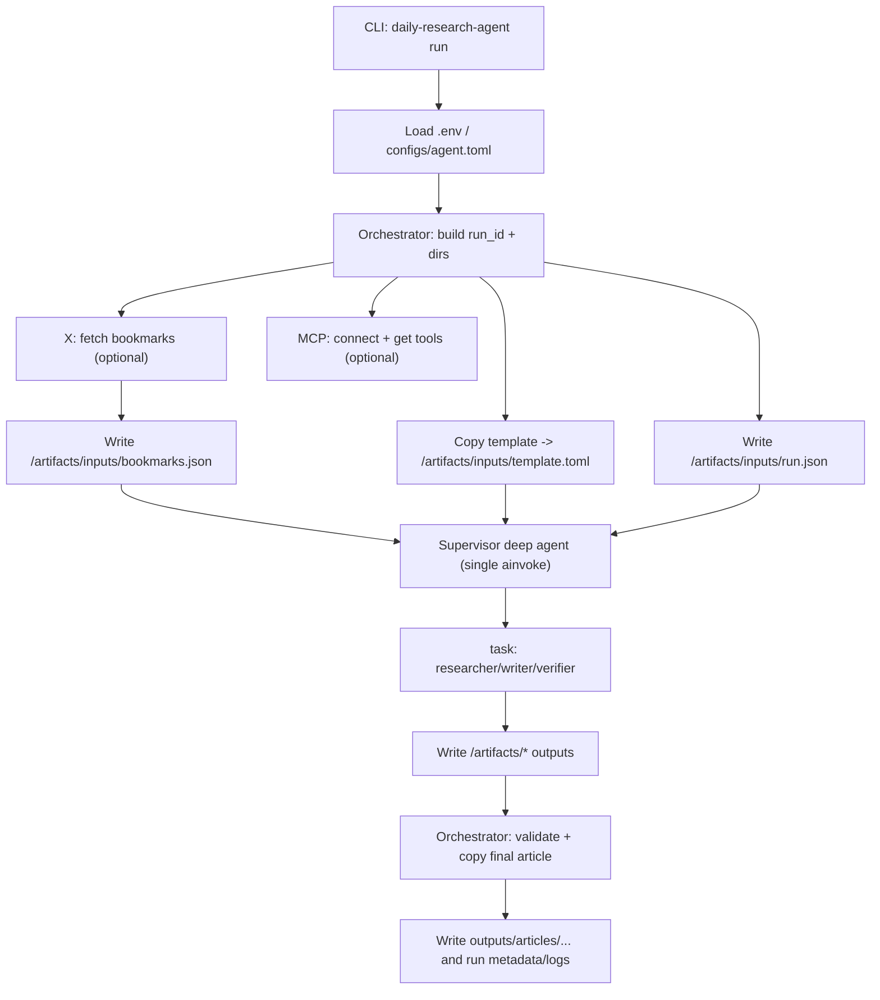

# daily-research-agent 詳細設計書

最終更新: 2026-02-01

この設計書は `docs/requirements.md` の要件・制約を一次情報として作成する。
本書は **現状実装の唯一の真実（source of truth）** とし、実装と齟齬がある記述は置かない。

## 1. 目的 / 非目的

### 目的（In Scope）

- ローカル環境（PC / Ubuntu Server）で動作する「定時リサーチ→記事作成」エージェントを構築する
- 入力された記事要件（プリセット/テンプレ/制約）を満たす Markdown 記事を生成してローカルに保存する
- 情報源
  - MCP 経由の Web リサーチ（Perplexity MCP Server を想定、複数ソース・一次情報を優先）
  - X（Twitter）ブックマーク取得（X API v2）
- エージェントが不足情報を検知して追加調査を自走できる（エージェンティック要件）

### 非目的（Out of Scope）

- Hugo 等での公開/デプロイ、CI、通知連携
- GUI/Web UI（CLIのみ）
- 100% の正確性保証（ただし“それっぽい断定”の抑制は必須）

## 2. 全体アーキテクチャ

### 2.1 コンポーネント

- CLI（エントリポイント）
  - run の開始、設定読込、Orchestrator 起動、終了ステータス返却
- Orchestrator（Python）
  - run_id 払い出し、入力アーティファクト準備（X/MCP/テンプレ/設定）、Supervisor 実行、成果物検証・保存
- Supervisor deep agent（deepagents）
  - `write_todos` で計画し、`task` で subagent に委譲し、filesystem tools で成果物を `/artifacts/` へ書く
- Subagents（deepagents / `task`）
  - Researcher / Writer / Verifier（役割・権限は `configs/agent.toml` で定義）
- Integrations
  - MCP client（`langchain-mcp-adapters`）：MCP server から LangChain tools を取得
  - X bookmarks client：X API v2 からブックマークを取得（キャッシュ/リフレッシュ含む）
- Artifact Store（出力）
  - `outputs/runs/<run_id>/`（run 単位の成果物 + 監査ログ）
  - `outputs/articles/YYYY-MM-DD/`（記事の公開用コピー）
- State（実行間状態）
  - `state/`（X ブックマークキャッシュ SQLite / X OAuth token cache など）

### 2.2 データフロー（概略）



## 3. 技術選定（前提ライブラリ）

依存管理は uv のみ（`python` / `pip` コマンドは禁止）。

| 用途 | パッケージ |
|---|---|
| deep agents | `deepagents` |
| ワークフロー | `langgraph` |
| LLM基盤 | `langchain` / `langchain-core` |
| OpenAI互換（OpenRouter） | `langchain-openai` |
| MCP→LC tool | `langchain-mcp-adapters` |
| CLI | `typer` |

## 4. 置き場所 / ディレクトリ構成

```
.
├── configs/
│   ├── agent.toml
│   └── agent.example.toml
├── docs/
│   ├── requirements.md
│   ├── design.md
│   └── deepagents_refactor_plan.md
├── templates/
│   └── article_default.toml
├── outputs/                # 生成物（Git管理しない想定）
│   ├── articles/
│   └── runs/
├── state/                  # 実行間状態（Git管理しない想定）
├── src/daily_research_agent/
│   ├── cli.py
│   ├── orchestrator.py
│   ├── config.py
│   ├── prompting.py
│   ├── audit.py
│   ├── tool_limits.py
│   ├── logging.py
│   ├── artifacts/
│   │   ├── paths.py
│   │   └── writer.py
│   ├── integrations/
│   │   ├── mcp_client.py
│   │   └── x_bookmarks.py
│   ├── tools/
│   │   └── x_oauth.py
│   └── domain/
│       ├── models.py
│       └── prompts.py      # ※記事テンプレ(TOML)のローダのみ（LLM向け文言は置かない）
└── pyproject.toml
```

## 5. CLI 仕様

### 5.1 コマンド

- `daily-research-agent run`
  - 単発実行（cron/systemd timer から呼べる）
- `daily-research-agent x-auth`
  - X OAuth2 (PKCE) のトークン取得（ブラウザ誘導）
- `daily-research-agent x-refresh`
  - refresh token で access token 更新

### 5.2 `run` の主要オプション

- `--preset`（必須）：プリセット名（`configs/agent.toml` の `[presets.<name>]`）
- `--date`（任意）：記事日付（YYYY-MM-DD、未指定なら OS のローカル日付）
- `--config`（任意）：設定TOML（デフォルト `./configs/agent.toml`）

## 6. TOML 設定設計（プロンプト/エージェント/挙動）

### 6.1 設計原則（現状実装）

- **LLM向けの指示文（system/user/skills）は TOML（`configs/agent.toml`）へ集約**し、Python はレンダリングして渡すだけにする
- CLI は `--preset` で運用し、テーマ入力の `--topic` は持たない
- 暴走防止の上限（`max_web_queries` など）は TOML で管理する

### 6.2 `configs/agent.toml` の主要セクション（実装準拠）

- `[run]`
  - `output_dir` / `timezone` / `max_web_queries` / `state_dir`
  - `include_run_artifacts`（※現状実装では未使用。run artifacts は常に作成される）
- `[deepagents]`
  - `interrupt_on`（HITL：対象ツールで停止。空なら無効）
  - `tool_token_limit_before_evict`（※現状実装では未適用。deepagents のデフォルト値に従う）
- `[prompts]`
  - `language` / `source_priority`（共通ポリシー文字列）
  - `[prompts.presets.<id>]`（プリセット用の本文。`{date}` のみを `resolve_preset()` が展開）
  - `[prompts.registry.<key>]`（Supervisor/Subagent/Skill の本文）
- `[presets.<name>]`
  - `template`（記事テンプレ TOML へのパス）
  - `prompt_id`（`prompts.presets.<id>` を参照）
- `[agents.supervisor]` / `[agents.subagents.<name>]`
  - `model` / `prompt_id` / `skills` / `tools.allow|deny` / `subagents` / `user_prompt_id`
- `[sources]`
  - `daily_sites`（毎日チェック対象）
- `[logging]` / `[logging.audit]`
  - ローカルログと監査ログ（JSONL）
- `[x]` / `[x.cache]` / `[x.quote]`
  - X 取得の有効/無効・件数・ポリシー・キャッシュ
- `[mcp]`
  - `servers`（stdio/http）/ `env_allowlist`（stdio 子プロセスへ渡す env の allowlist）
- `[observability.langsmith]`
  - `enabled` / `project`（シークレットは env）

### 6.3 Prompt レンダリング（現状実装）

- Supervisor/Subagent/Skill の prompt は `render_prompt_with_dotted()` でレンダリングする
- 参照できる代表的な変数（`src/daily_research_agent/orchestrator.py` の `prompt_context` 準拠）：
  - `{date}` / `{timezone}` / `{preset_name}` / `{preset_prompt}` / `{max_web_queries}`
  - `{language}` / `{source_priority}` / `{x_usage_policy}` / `{daily_sites}`
  - `{artifact_paths.inputs.bookmarks_json}` など（artifact contract）
  - `{run_id}` / `{x_failed}` / `{mcp_failed}`

## 7. 設定 / シークレット

### 7.1 設定の優先順位（現状実装）

1. CLI 引数
2. 環境変数（`.env` を `dotenv` でロード）
3. `configs/agent.toml`
4. デフォルト値（`config.py`）

### 7.2 必須になりうる環境変数（現状実装）

- OpenRouter（LLM）
  - `OPENROUTER_API_KEY`
  - `OPENROUTER_BASE_URL`（デフォルト `https://openrouter.ai/api/v1`）
  - `OPENROUTER_HTTP_REFERER` / `OPENROUTER_X_TITLE`（任意）
  - `OPENROUTER_MAX_TOKENS`（任意。未設定時 `4096`）
- LangSmith（Tracing）
  - `LANGSMITH_API_KEY` / `LANGSMITH_ENDPOINT` 等（任意）
- MCP（Perplexity など）
  - MCP server が要求する場合の API key（例: `PERPLEXITY_API_KEY`）
- X API v2（ブックマーク）
  - `X_USER_ACCESS_TOKEN`（OAuth2 User token。token cache があれば省略可）
  - `X_REFRESH_TOKEN` / `X_CLIENT_ID` / `X_CLIENT_SECRET`（リフレッシュに必要な場合）
  - `X_API_BASE_URL`（デフォルト `https://api.x.com`）

## 8. 外部連携の詳細

### 8.1 MCP

#### 接続方式（現状実装）

- `transport = "stdio"`：`command` + `args` で MCP server を起動
- `transport = "http"`：`url` へ接続

#### ツールの扱い（現状実装）

- `langchain_mcp_adapters.client.MultiServerMCPClient` で tool 一覧を取得し、そのまま deepagents（custom tools）へ渡す
- tool の許可/禁止は `tool.name` に対して `agents.*.tools.allow|deny` で制御する
  - `"*"` は全許可を意味する
  - allow が空のときは全拒否（custom tools なし）
- stdio MCP server に渡す環境変数は `mcp.env_allowlist` のみ（+ 各 server 定義の `env` 上書き）

### 8.2 LLM（OpenRouter）

方針（現状実装）:
- LLM プロバイダは OpenRouter に統一する
- `langchain_openai.ChatOpenAI` を利用し、`api_key`/`base_url` を OpenRouter に向ける

### 8.3 X API v2（ブックマーク取得）

#### コスト最適化（現状実装）

- 取得済みのブックマークは `state/x_bookmarks_cache.sqlite` にキャッシュし、再取得を抑制する
- 連続して既知ポストが出た場合、`x.cache.stop_on_seen_streak` で打ち切る
- 引用ポストは `x.quote.resolve_depth` の範囲で解決して入力に含める

#### トークン運用（現状実装）

- `.env` の `X_USER_ACCESS_TOKEN` があれば利用する
- そうでなければ `state/` 配下の token cache を読み、必要なら refresh を試みる（`x-auth` / `x-refresh` コマンドも提供）

## 9. 成果物（artifact contract + run outputs）

### 9.1 run_id と出力ディレクトリ

- run_id 形式: `{YYYY-MM-DD}-{HHMMSS}-{uuid8}`
- run_dir: `outputs/runs/<run_id>/`

### 9.2 artifact contract（deepagents が読む/書く仮想パス）

Supervisor/Subagents は `/artifacts/` 以下のみを契約として扱う（パスは prompt へ注入される）。
実体は `outputs/runs/<run_id>/artifacts/` に保存される。

- 入力
  - `/artifacts/inputs/bookmarks.json`
  - `/artifacts/inputs/template.toml`
  - `/artifacts/inputs/run.json`
- 調査
  - `/artifacts/research/findings.json`
  - `/artifacts/research/sources.json`
  - `/artifacts/research/memo.md`
- 下書き
  - `/artifacts/draft/article.md`
- 最終
  - `/artifacts/final/article.md`
- 診断
  - `/artifacts/run/diagnostics.md`

### 9.3 Orchestrator が保存する run 成果物（現状実装）

- `outputs/articles/YYYY-MM-DD/<slug>-<run_suffix>.md`
  - 最終記事（`/artifacts/final/article.md` のコピー）
- `outputs/runs/<run_id>/run.json`
  - run メタデータ（preset/date/git_sha 等、開始・終了時刻を含む）
- `outputs/runs/<run_id>/bookmarks.json`
  - 入力として使用したブックマーク（`/artifacts/inputs/bookmarks.json` のコピー）
- `outputs/runs/<run_id>/research.md`
  - `memo.md` が存在すればコピー（存在しない場合は作られない）
- `outputs/runs/<run_id>/sources.json`
  - `sources.json` が存在すればコピー（存在しない場合は作られない）
- `outputs/runs/<run_id>/app.log`
  - Python logger のログ（JSON）
- `outputs/runs/<run_id>/audit.jsonl`
  - 監査ログ（JSONL、内容本文は保存しない）

## 10. エージェント設計（deepagents）

### 10.1 役割分割（現状実装）

- Orchestrator（Python）
  - 事前準備（X/MCP/入力アーティファクト作成）と、事後検証（最終記事の存在確認、診断ファイル作成）に寄せる
- Supervisor deep agent（トップレベルは 1 回の `ainvoke`）
  - `write_todos` で計画 → `task` で subagent 呼び出し → `/artifacts/` へ書き込み
- Researcher subagent
  - MCP tools（許可されている場合）で追加調査し、`findings.json` / `sources.json` / `memo.md` を作る
- Writer subagent
  - `findings.json` / `sources.json` / `template.toml` を読み、`final/article.md` を作る（下書きは任意）
- Verifier subagent
  - 最終稿の断定度・参照不足等を確認し、必要に応じて `diagnostics.md` へ記録する

### 10.2 Backend / 書き込み境界（現状実装）

- deepagents backend は `CompositeBackend` を使用する
  - default: `StateBackend`（scratch/skills の仮想ファイル）
  - route: `"/artifacts/" -> FilesystemBackend(root_dir=outputs/runs/<run_id>/, virtual_mode=True)`
- これにより、永続化が必要な成果物は `/artifacts/` に集約される（repo ルート等へ書かない）

### 10.3 Skills（現状実装）

- skill 本文も `prompts.registry`（TOML）を真実とする
- run 実行時に `invoke(files={...})` で `/skills/<skill_id>/SKILL.md` を StateBackend へ seed し、`skills=["/skills/"]` を渡す

### 10.4 暴走防止（現状実装）

- `run.max_web_queries` は **ツール層で強制**する
  - MCP 接続で取得した tool 名集合（`tool_names`）への呼び出し回数をカウントし、超過で例外
  - 超過イベントは `audit.jsonl` に `tool_limit_exceeded` として記録する

## 11. セキュリティ / コンプライアンス（現状実装）

- シークレットは環境変数（`.env`）で管理し、リポジトリにコミットしない
- MCP stdio 子プロセスへ環境変数を丸ごと渡さない（`mcp.env_allowlist` のみ渡す）
- X コンテンツは URL 参照・短い引用・要約中心（過剰転載の回避）

## 12. 観測 / ログ（現状実装）

### 12.1 LangSmith

- `observability.langsmith.enabled=true` の場合、Orchestrator が以下を設定する
  - `LANGSMITH_TRACING=true`
  - `LANGSMITH_PROJECT=<config value>`
  - `LANGSMITH_RUN_ID=<run_id>`（既に環境変数が無い場合のみ）
- `enabled=false` の場合は `LANGSMITH_TRACING=false` を設定する

### 12.2 Python logger（`app.log`）

- run ごとに `outputs/runs/<run_id>/app.log` を保存する

### 12.3 監査ログ（`audit.jsonl`）

- 監査ログは JSONL（1 行 1 イベント）で `outputs/runs/<run_id>/audit.jsonl` に保存する
- 保存するのは **メタデータのみ**（プロンプト本文、検索クエリ本文、取得ページ本文、生成本文は保存しない）
- 代表的なイベント（抜粋）
  - run lifecycle: `run_started` / `run_finished`
  - X: `x_fetch_started` / `x_fetch_finished`
  - MCP: `mcp_connect_started` / `mcp_connect_finished`
  - agent invoke: `agent_invoke_started` / `agent_invoke_finished` / `agent_invoke_failed`
  - tools: `tool_started` / `tool_finished` / `tool_failed`（入力/出力はサイズとキーのみ）
  - LLM: `llm_started` / `llm_finished` / `llm_failed`

## 13. 障害時の挙動（現状実装）

- X ブックマーク取得が失敗
  - `x_failed=true` を `inputs/run.json` に残す
  - 可能ならキャッシュから読み込む（設定有効時）
- MCP 接続が失敗
  - `mcp_failed=true` を `inputs/run.json` に残す
  - MCP tools なしで Supervisor を実行する（プロンプト側で制約を明記する前提）
- Supervisor が最終記事を出力しない
  - `outputs/runs/<run_id>/artifacts/run/diagnostics.md` に理由を残し、Orchestrator は例外で終了する
- 最終記事があるが品質警告がある（例: URL が無い）
  - `diagnostics.md` に警告を残す（run 自体は成功扱い）

## 14. Docker / Compose（運用: Ubuntu / amd64）

運用イメージ:
- 運用環境（Ubuntu / amd64）にこのリポジトリを `git clone`
- `.env` と `configs/agent.toml` を編集
- 常駐はせず、`docker compose run --rm` による “コマンド単発実行” に寄せる
  - ビルド: `docker compose build`
  - 実行（例）: `docker compose run --rm app uv run daily-research-agent run --preset daily_ai_news --date 2026-02-01`

## 15. 確定した意思決定（現状実装の反映）

- 記事テンプレは TOML テンプレファイルで管理（`templates/*.toml`）
- 記事テーマ/指示はプリセット（TOML）で運用し、CLI の `--topic` は持たない
- LLM は OpenRouter に統一し、モデル ID は `configs/agent.toml` で切替する
- deepagents-first：Supervisor + subagents + filesystem（artifact contract）を前提にする
- X/MCP の失敗はログに残しつつ継続し、不確実性は記事/メモ/診断へ残す（プロンプト運用）
