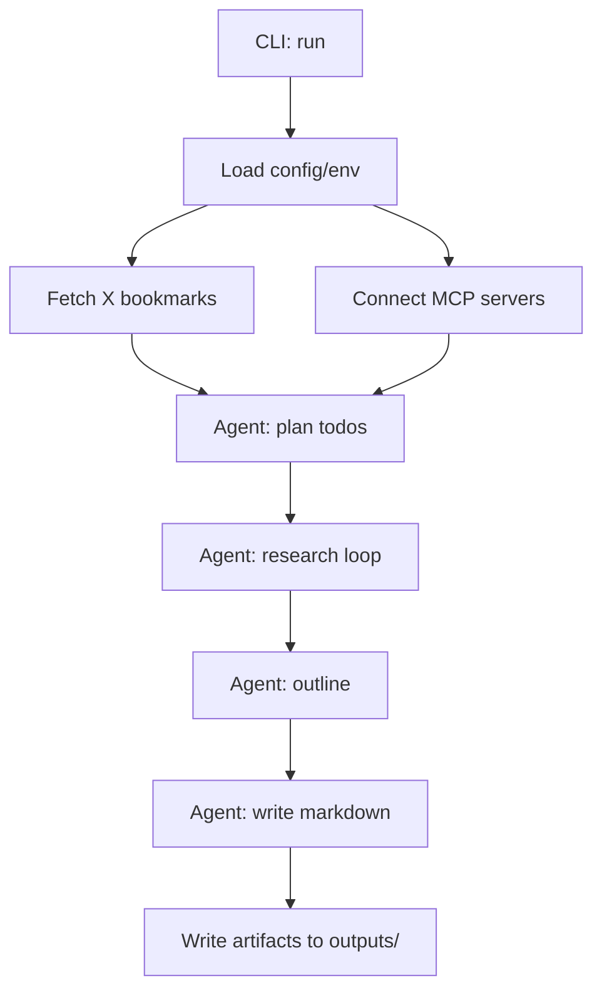

# daily-research-agent 詳細設計書

最終更新: 2026-02-01

この設計書は `docs/requirements.md` の要件・制約を一次情報として作成する。

## 1. 目的 / 非目的

### 目的（In Scope）

- ローカル環境（PC / Ubuntu Server）で動作する「定時リサーチ→記事作成」エージェントを構築する
- 入力された記事要件（テーマ/制約/品質条件）を満たす Markdown 記事を生成してローカルに保存する
- 情報源
  - MCP 経由の Web リサーチ（Perplexity MCP Server を想定、複数ソース・一次情報を優先）
  - X（Twitter）ブックマーク取得（X API v2）
- エージェントが不足情報を検知して追加調査を自走できる（エージェンティック要件）

### 非目的（Out of Scope）

- Hugo 等での公開/デプロイ、CI、通知連携
- GUI/Web UI（CLIのみ）
- 100% の正確性保証（ただし“それっぽい断定”の抑制は必須）

## 2. 全体アーキテクチャ

### 2.1 コンポーネント

- CLI（エントリポイント）
  - 実行単位（run）の開始、設定読込、成果物の保存先確保、終了ステータスの返却
- Agent Orchestrator（deepagents + langgraph）
  - TODO 生成（調査計画）、サブエージェント起動、成果物の集約、記事生成
- Research Integrations
  - MCP Research Client：Perplexity MCP Server などの MCP サーバーに接続し、検索/調査ツールを呼び出す
  - X Bookmarks Client：X API v2 からブックマークを新しい順に取得する
- Artifact Store（ファイル出力）
  - 生成記事（Markdown）と、調査メモ・参照ソース・実行ログを run 単位で保存

### 2.2 データフロー（概略）



## 3. 技術選定（前提ライブラリ）

依存管理は uv のみ（`python` / `pip` コマンドは禁止）。

本プロジェクトの中心となるライブラリは以下を想定する。

> 注: “最新バージョン” は設計書に固定せず、実装時に `uv add <package>` で解決・`uv lock` で固定する。

| 用途 | パッケージ |
|---|---|
| deep agents | `deepagents` |
| ワークフロー | `langgraph` |
| LLM基盤 | `langchain` / `langchain-core` |
| OpenAI互換（OpenRouter） | `langchain-openai` |
| MCP SDK | `mcp` |
| MCP→LC tool | `langchain-mcp-adapters` |

補助（実装フェーズで導入する可能性が高いもの）：

- `pydantic` / `pydantic-settings`（設定・データモデル）
- `typer`（CLI）
- `httpx`（X API 呼び出し）

## 4. 置き場所 / ディレクトリ構成

```
.
├── docs/
│   ├── requirements.md
│   └── design.md
├── configs/                # 設定（TOML）
│   ├── agent.toml
│   └── agent.example.toml
├── templates/              # 記事テンプレ（TOML）
│   └── article_default.toml
├── outputs/                # 生成物（Git管理しない想定）
│   ├── articles/
│   └── runs/
├── state/                  # 実行間の状態（Git管理しない）
├── src/
│   └── daily_research_agent/
│       ├── cli.py
│       ├── config.py
│       ├── orchestrator.py
│       ├── integrations/
│       │   ├── mcp_client.py
│       │   └── x_bookmarks.py
│       ├── artifacts/
│       │   ├── paths.py
│       │   └── writer.py
│       └── domain/
│           ├── models.py
│           └── prompts.py
└── pyproject.toml
```

補足：
- `outputs/` は run ごとの成果物（記事・調査メモ・参照ソース一覧）を保存するためのディレクトリ。
- 実運用でリポジトリ内に保存する場合でも、肥大化しやすい中間生成物は `.gitignore` 対象にする。

## 5. CLI 仕様

### 5.1 コマンド

- `daily-research-agent run`
  - 単発実行（cron/systemd timer からも呼べる）

### 5.2 主要オプション

- `--preset`（必須）：実行プリセット名（`configs/agent.toml` の `[presets.<name>]`）
- `--date`（任意）：記事日付（未指定ならローカル日付）
- `--config`（任意）：エージェント設定TOMLのパス（デフォルト: `./configs/agent.toml`）
- `--date` 以外の運用パラメータ（X/MCP/上限/テンプレ等）は原則 TOML に寄せる
- `--dry-run`（任意）：外部I/Oを行わず計画のみ作成（設計上の将来拡張）

## 6. TOML 設定設計（プロンプト/テンプレ/挙動）

要件:
- エージェントのプロンプトや設定可能値は TOML ファイルで管理する
- 記事の章立て（標準テンプレ）も TOML テンプレファイルで管理する
- OpenRouter のモデルID（例: `openai/gpt-5.2`）を TOML で切り替えられるようにする

### 6.1 設定ファイルの置き場所

- `configs/agent.toml`（運用で編集する。Git 管理）
- `configs/agent.example.toml`（雛形。Git 管理）
- `templates/article_default.toml`（標準テンプレ。Git 管理）

### 6.2 `configs/agent.toml`

主要な想定セクション：

- `[run]`：出力先、run上限、言語/タイムゾーンなど
- `[models]`：役割→モデル割当（OpenRouter の `provider/model` 文字列）
- `[prompts]`：共通ポリシー（言語、ソース優先、ガードレール）
- `[prompts.presets.<id>]`：日々作り込むプリセット用プロンプト
- `[presets.<name>]`：プリセット（テンプレ/プロンプトID/周辺設定の束）
- `[sources]`：毎日チェックすべきサイト/フィード/コミュニティ（例: HN, Reddit, OpenAI release notes）
- `[x]`：ブックマーク取得の有効/無効、取得件数、取り扱いポリシー
- `[x.cache]`：ブックマーク再取得を抑制するローカルキャッシュ（コスト最適化）
- `[x.quote]`：引用ポスト追跡（引用元を辿る深さ）
- `[mcp]`：接続先 MCP server 群（stdio/HTTP）、tool 名の正規化ルール
- `[observability.langsmith]`：Tracing 有効/無効、project 名（シークレットは env）
- `[logging]`：ローカルログ（Python logger）

#### モデル割当の考え方

モデル切替は OpenRouter に寄せるため、設定は “OpenRouter の model ID” を持つ。
（例: `openai/gpt-5.2`, `anthropic/claude-sonnet-4-5`）

- `models.main`：エージェント駆動（TODO生成、統合判断）
- `models.writer`：記事執筆
- `models.researcher`：調査（必要なら）
- `models.verifier`：表現/出典チェック（将来）

### 6.3 `templates/article_default.toml`

テンプレは「記事の章立て」「各章の意図」「章ごとの品質条件」を構造化して持つ。

- title 生成ルール
- section の配列（id, heading, intent, required, guidance）
- references（出典セクションのフォーマット）

## 7. 設定 / シークレット

### 7.1 設定の優先順位

1. CLI 引数
2. 環境変数（`.env`）
3. `configs/agent.toml`
4. デフォルト値

### 7.2 必須になりうる環境変数

- LLM（OpenRouter）
  - `OPENROUTER_API_KEY`
  - `OPENROUTER_BASE_URL`（例: `https://openrouter.ai/api/v1`）
  - `OPENROUTER_HTTP_REFERER`（任意）
  - `OPENROUTER_X_TITLE`（任意）
- LangSmith（Tracing）
  - `LANGSMITH_TRACING`（例: `true`）
  - `LANGSMITH_API_KEY`
  - `LANGSMITH_ENDPOINT`（例: `https://api.smith.langchain.com`）
  - `LANGSMITH_PROJECT`
  - `LANGSMITH_TRACING_SAMPLING_RATE`（任意）
  - `LANGSMITH_WORKSPACE_ID`（任意）
- MCP（Perplexity など）
  - Perplexity MCP Server が API Key を要求する場合は `PERPLEXITY_API_KEY`
- X API v2（ブックマーク）
  - `X_USER_ACCESS_TOKEN`（OAuth2 User token）
  - `X_API_BASE_URL`（デフォルト: `https://api.x.com`）

## 8. 外部連携の詳細

### 8.1 MCP（Perplexity MCP Server）

#### 接続方式

- stdio（ローカルで MCP Server を起動する）または
- HTTP/SSE（既に起動済みの MCP Server に接続）

どちらもサポートできる設計にし、サーバー情報は設定で差し替え可能にする。

#### Tool 契約（想定）

MCP 側が提供する tool 名・引数はサーバー実装により異なるため、Orchestrator 側は以下の “論理ツール” に正規化する。

- `web_search(query, recency_days, domain_allowlist?) -> list[Source]`
- `web_read(url) -> Page`

（実装では `langchain-mcp-adapters` により MCP の tool を LangChain tool として扱い、ラッパーで正規化する）

### 8.2 LLM（OpenRouter）

方針:
- LLM プロバイダは OpenRouter に寄せる（モデル切替の実装/運用を軽くする）
- OpenRouter は OpenAI 互換 API として利用する（`OPENROUTER_BASE_URL` を指定）
- モデルは OpenRouter の model ID 文字列（例: `openai/gpt-5.2`）を `configs/agent.toml` で切り替える

実装（案）：
- `langchain-openai` の ChatOpenAI を使い、`base_url` と `api_key` を OpenRouter に向ける
- 任意で `OPENROUTER_HTTP_REFERER` / `OPENROUTER_X_TITLE` をヘッダとして付与する（OpenRouter 推奨）

### 8.3 X API v2（ブックマーク取得）

#### 前提

- User context の OAuth2（PKCE）で取得した `X_USER_ACCESS_TOKEN` を利用する
- Scope は少なくとも `bookmark.read` が必要
  - 参照: https://docs.x.com/x-api/posts/bookmarks/introduction

#### 取得フロー

1. `GET /2/users/me` で自身の `user_id` を取得
2. `GET /2/users/{id}/bookmarks` を呼び出し、`max_results`（例: 5〜100）で件数取得
3. `expansions` と `tweet.fields` / `user.fields` を指定して、記事生成に必要な情報を同時取得する

補足：
- `GET /2/users/{id}/bookmarks` の返却上限やフィールドは X API の仕様に従う（実装時に確認する）。

#### コスト最適化（再取得抑制キャッシュ）

要件: ブックマーク取得は 1 ポストごとに課金される（例: $0.005/ポスト）ため、前回取得済みのポストはなるべく再取得しない。

設計（案）：

- run をまたいで永続化されるローカルキャッシュを用意する（例: SQLite）
  - デフォルト: `./state/x_bookmarks_cache.sqlite`（`run.state_dir` 配下）
- 取得は “新しい順” なので、先頭からページングしつつ以下の戦略を取る：
  1) API から 1 ページ取得
  2) そのページ内の tweet_id をキャッシュと突合
  3) 未キャッシュ（=新規）だけを保存・入力データに採用
  4) “既に見た tweet_id が連続して一定数” になったら、以降は新規が出にくいと判断して取得を打ち切る
- 打ち切り条件は `x.cache.stop_on_seen_streak` で調整可能にする

キャッシュに保存する情報（最低限）：
- tweet_id, url, text, author, created_at
- 引用ポスト（後述）の解決結果
- 取得日時（クリーンアップ/再検証用）

#### 引用ポストの追跡（引用元を辿る）

要件: ブックマーク取得時に、引用ポストの引用元も辿れるようにする。

設計（案）：

- `tweet.fields` に `referenced_tweets` を含める
- `expansions` に `referenced_tweets.id`（必要に応じて `referenced_tweets.id.author_id`）を含め、引用元ポストを同レスポンス内で可能な限り取得する
- 引用元がさらに引用しているケースもあるため、`x.quote.resolve_depth` を設けて深さを制御する（例: 2）
- 引用元が expansions に含まれない場合は `GET /2/tweets` で補完取得する（追加コスト/制限に注意）

#### 取得データ（最低限）

- ポスト URL（`https://x.com/{username}/status/{id}` 形式）
- 本文
- 著者（username / 表示名）
- 作成時刻

## 9. ドメインモデル

### 9.1 主要データ構造

- `RunConfig`
  - preset, date, output_dir, max_web_queries, state_dir, …
- `BookmarkPost`
  - id, url, text, author_username, author_name, created_at, referenced_posts[]
- `Source`
  - url, title, publisher, published_at?, snippet?
- `Finding`
  - claim（主張）, evidence（根拠の要約）, sources（Source の配列）, confidence（低/中/高）
- `Article`
  - title, dek, sections[], references[]

### 9.2 成果物（ファイル）

run を再現・改善しやすくするため、少なくとも以下を保存する。

- `outputs/articles/YYYY-MM-DD/<slug>.md`
  - 生成記事（本文 + 参考リンク/出典）
- `outputs/runs/<run_id>/research.md`
  - 調査メモ（サブクエリ、要点、採用/非採用理由、未解決点）
- `outputs/runs/<run_id>/sources.json`
  - 参照ソースの正規化一覧（URL重複排除）
- `outputs/runs/<run_id>/bookmarks.json`
  - 取り込んだ X ブックマーク（記事に直使用しない場合も入力として保存）
- `outputs/runs/<run_id>/run.json`
  - 実行設定・バージョン情報・タイムスタンプ

## 10. エージェント設計（deepagents）

### 10.1 役割分割

- Main Agent（Orchestrator）
  - プリセット（プロンプト/テンプレ/設定）を解釈し、TODO を生成する
  - サブエージェント（Researcher/Writer/Verifier）を呼び出し、成果物を統合する
- Researcher Agent
  - サブクエリを作り、MCP ツールで Web 調査する
  - 根拠不足の主張は “不確実” として扱う（断定を避ける）
- Writer Agent
  - Finding 群から、比較・論点整理・トレードオフを含む Markdown 記事に落とす
  - 出典（URL）を必ず残す
- Verifier Agent（将来拡張）
  - 断定表現の検知、出典の不足チェック、引用粒度チェック

### 10.2 暴走防止（必須）

- `max_web_queries` の上限（run config）
- 1クエリあたりのタイムアウト（MCP / HTTP）
- 同一URLの再読込抑制（キャッシュ）
- TODO の数・深さの上限

## 11. セキュリティ / コンプライアンス

- シークレットは環境変数（`.env`）で管理し、リポジトリにコミットしない
- ファイル書き込み先は `output_dir` 配下に限定（意図しない場所への書き込み防止）
- X コンテンツは URL 参照・短い引用・要約中心（過剰転載の回避）

## 12. 観測（Tracing/評価）

目的:
- 日々の運用改善（プロンプト/ソース/手順の調整）を短いサイクルで回す
- “どのツール呼び出し/どのソース/どのプロンプト” で結果が良くなった/悪くなったかを後から追えるようにする

### 12.1 LangSmith（Tracing / Dataset / Evaluation）

方針:
- LangChain / LangGraph / deepagents の実行を LangSmith に Trace 送信する
- run 単位で `LANGSMITH_PROJECT` を分けられるようにする（デフォルト: `daily-research-agent`）
- エラー・失敗（X/MCP の失敗）も Trace に残す（ただしシークレットは送らない）

設定:
- LangSmith は環境変数で有効化する
  - `LANGSMITH_TRACING=true`
  - `LANGSMITH_API_KEY=...`（シークレット）
  - `LANGSMITH_ENDPOINT=https://api.smith.langchain.com`
  - `LANGSMITH_PROJECT=daily-research-agent`
  - `LANGSMITH_TRACING_SAMPLING_RATE=1.0`（任意）
  - `LANGSMITH_WORKSPACE_ID=...`（任意）
- 設定ファイル側は “有効/無効” と “project 名” のみを持ち、シークレットは `.env` に分離する
  - `configs/agent.toml` の `[observability.langsmith]`

実装要件（実装フェーズで満たす）:
- CLI 実行ごとに run_id を払い出し、LangSmith の run metadata/tags に付与する
  - 例: `run_id`, `preset`, `date`, `x_enabled`, `bookmarks_count`, `mcp_servers`, `git_sha`
- 生成物 `outputs/runs/<run_id>/run.json` に LangSmith の project 名などの識別情報を保存する
- 終了時に Trace が送信完了していることを担保する（背景送信の場合は flush/wait を入れる）

### 12.2 ローカルログ（Python logger）

LangSmith とは別に、ローカルにもログを残す（障害解析・コスト監視・運用改善のため）。

要件:
- run ごとにファイルに保存する
- 重要イベント（X/MCP 失敗、キャッシュヒット率、取得件数、実行時間）を必ず残す

設計（案）：
- 出力先: `outputs/runs/<run_id>/app.log`
- フォーマット: JSON（集計しやすさ優先）
- 併用: stdout へも出す（Docker 実行時に見やすい）

## 13. 運用（定時実行）

初期は OS のスケジューラで十分。

- cron（例）: 毎日 07:00 に `docker compose run --rm ...` を実行し `outputs/` に保存
- systemd timer（Ubuntu）: `docker compose run --rm ...` を呼ぶ service/timer を用意して実行

（どちらも “コマンド1つで記事生成” を満たすために、CLI の引数・設定で完結させる）

## 14. テスト方針（最小）

- 単体
  - slug 生成、パス解決、出力フォーマット、設定優先順位
- 結合（任意）
  - X API クライアント（モック/録画）
  - MCP 呼び出し（スタブ MCP server での疎通）

## 15. 障害時の挙動（確定事項）

- X ブックマーク取得が失敗
  - エラーを run ログに記録
  - 記事内にも「X ブックマーク取得に失敗したため、当該入力は利用できなかった」旨を明記
  - Web リサーチのみで継続
- MCP（Perplexity 等）呼び出しが失敗
  - エラーを run ログに記録
  - 記事内にも「外部リサーチが一部失敗した」旨を明記
  - 取得済み情報の範囲で継続（不足は不確実として表現）

## 16. Docker / Compose（運用: Ubuntu / amd64）

運用イメージ:
- 運用環境（Ubuntu / amd64）にこのリポジトリを `git clone`
- `.env` と `configs/agent.toml` などを編集
- 常駐はせず、`docker compose run --rm` による “コマンド単発実行” に寄せる
  - ビルド: `docker compose build`
  - 実行（例）: `docker compose run --rm app uv run daily-research-agent run --preset daily_ai_news --date 2026-02-01`

### 16.1 目標

- macOS/ARM で開発し、Ubuntu/amd64 にそのまま持っていける
- 依存解決は uv、設定は TOML + 環境変数
- `outputs/` をホスト側に永続化する（ボリューム or bind mount）

### 16.2 Compose 設計

- `compose.yaml` に `app` サービスを定義
- `./configs` と `./templates` をコンテナにマウント（運用時に編集しやすくする）
- `./outputs` をコンテナにマウント（成果物永続化）
- `./state` をコンテナにマウント（X ブックマークキャッシュなどの永続化）
- `.env` を読み込んでシークレットを注入

### 16.3 Dockerfile 設計

- ベース: `python:3.13-slim`
- uv を導入し、`pyproject.toml` から `uv sync` で依存を構築
- “単発実行” を前提に、Compose 側から `uv run ...` を渡して実行する

## 17. 確定した意思決定（あなたの回答の反映）

- 記事テンプレは TOML テンプレファイルで管理
- 出力言語は TOML 内のプロンプトで個別指定
- 記事テーマ/指示は “プリセット（TOML）” で運用し、CLI の `--topic` は持たない
- LLM プロバイダは OpenRouter に寄せ、モデルID（例: `openai/gpt-5.2`）で切り替える
- X ブックマークは設定で有効/無効切替
  - 有効時は “注目ニュースの種” として活用（そのまま引用せず、要約/追加調査して記事化）
  - 情報源として X ポスト URL は references に追加
  - 取得コスト最適化のため、ローカルキャッシュで再取得を抑制する
  - 引用ポストは引用元も辿れるようにする（深さ制御）
- 出力先は `outputs/articles/YYYY-MM-DD/` で確定
- ソース優先や毎日チェックすべきサイトはプロンプト/設定で指定
- X/MCP の失敗はログ + 記事内に断りを入れつつ継続
- 観測は LangSmith + ローカルログ（Python logger）を併用
- Docker 運用は常駐せず `docker compose run --rm` の単発実行に寄せる

## 18. 設定の置き方（確定事項）

- `configs/agent.toml` をリポジトリに置き、運用時に編集する
- MCP server の接続情報は `configs/agent.toml` に集約する
  - シークレットは `.env`（環境変数）に分離し、TOML に書かない
# daily-research-agent 詳細設計書

最終更新: 2026-02-01

この設計書は `docs/requirements.md` の要件・制約を一次情報として作成する。

## 1. 目的 / 非目的

### 目的（In Scope）

- ローカル環境（PC / Ubuntu Server）で動作する「定時リサーチ→記事作成」エージェントを構築する
- 入力された記事要件（テーマ/制約/品質条件）を満たす Markdown 記事を生成してローカルに保存する
- 情報源
  - MCP 経由の Web リサーチ（Perplexity MCP Server を想定、複数ソース・一次情報を優先）
  - X（Twitter）ブックマーク取得（X API v2）
- エージェントが不足情報を検知して追加調査を自走できる（エージェンティック要件）

### 非目的（Out of Scope）

- Hugo 等での公開/デプロイ、CI、通知連携
- GUI/Web UI（CLIのみ）
- 100% の正確性保証（ただし“それっぽい断定”の抑制は必須）

## 2. 全体アーキテクチャ

### 2.1 コンポーネント

- CLI（エントリポイント）
  - 実行単位（run）の開始、設定読込、成果物の保存先確保、終了ステータスの返却
- Agent Orchestrator（deepagents + langgraph）
  - TODO 生成（調査計画）、サブエージェント起動、成果物の集約、記事生成
- Research Integrations
  - MCP Research Client：Perplexity MCP Server などの MCP サーバーに接続し、検索/調査ツールを呼び出す
  - X Bookmarks Client：X API v2 からブックマークを新しい順に取得する
- Artifact Store（ファイル出力）
  - 生成記事（Markdown）と、調査メモ・参照ソース・実行ログを run 単位で保存

### 2.2 データフロー（概略）


## 3. 技術選定（前提ライブラリ）

依存管理は uv のみ（`python` / `pip` コマンドは禁止）。

本プロジェクトの中心となるライブラリは以下を想定する。

> 注: “最新バージョン” は設計書に固定せず、実装時に `uv add <package>` で解決・`uv lock` で固定する。

| 用途 | パッケージ |
|---|---|
| deep agents | `deepagents` |
| ワークフロー | `langgraph` |
| LLM基盤 | `langchain` / `langchain-core` |
| OpenAI互換（OpenRouter） | `langchain-openai` |
| MCP SDK | `mcp` |
| MCP→LC tool | `langchain-mcp-adapters` |

補助（実装フェーズで導入する可能性が高いもの）：

- `pydantic` / `pydantic-settings`（設定・データモデル）
- `typer`（CLI）
- `httpx`（X API 呼び出し）

## 4. 置き場所 / ディレクトリ構成

```
.
├── docs/
│   ├── requirements.md
│   └── design.md
├── configs/                # 設定（TOML）
│   ├── agent.toml
│   └── agent.example.toml
├── templates/              # 記事テンプレ（TOML）
│   └── article_default.toml
├── outputs/                # 生成物（Git管理しない想定）
│   ├── articles/
│   └── runs/
├── state/                  # 実行間の状態（Git管理しない）
├── src/
│   └── daily_research_agent/
│       ├── cli.py
│       ├── config.py
│       ├── orchestrator.py
│       ├── integrations/
│       │   ├── mcp_client.py
│       │   └── x_bookmarks.py
│       ├── artifacts/
│       │   ├── paths.py
│       │   └── writer.py
│       └── domain/
│           ├── models.py
│           └── prompts.py
└── pyproject.toml
```

補足：
- `outputs/` は run ごとの成果物（記事・調査メモ・参照ソース一覧）を保存するためのディレクトリ。
- 実運用でリポジトリ内に保存する場合でも、肥大化しやすい中間生成物は `.gitignore` 対象にする。

## 5. CLI 仕様

### 5.1 コマンド

- `daily-research-agent run`
  - 単発実行（cron/systemd timer からも呼べる）

### 5.2 主要オプション

- `--preset`（必須）：実行プリセット名（`configs/agent.toml` の `[presets.<name>]`）
- `--date`（任意）：記事日付（未指定ならローカル日付）
- `--config`（任意）：エージェント設定TOMLのパス（デフォルト: `./configs/agent.toml`）
- `--date` 以外の運用パラメータ（X/MCP/上限/テンプレ等）は原則 TOML に寄せる
- `--dry-run`（任意）：外部I/Oを行わず計画のみ作成（設計上の将来拡張）

## 6. TOML 設定設計（プロンプト/テンプレ/挙動）

要件:
- エージェントのプロンプトや設定可能値は TOML ファイルで管理する
- 記事の章立て（標準テンプレ）も TOML テンプレファイルで管理する
- OpenRouter のモデルID（例: `openai/gpt-5.2`）を TOML で切り替えられるようにする

### 6.1 設定ファイルの置き場所

- `configs/agent.toml`（運用で編集する。Git 管理）
- `configs/agent.example.toml`（雛形。Git 管理）
- `templates/article_default.toml`（標準テンプレ。Git 管理）

### 6.2 `configs/agent.toml`

主要な想定セクション：

- `[run]`：出力先、run上限、言語/タイムゾーンなど
- `[models]`：役割→モデル割当（OpenRouter の `provider/model` 文字列）
- `[prompts]`：共通ポリシー（言語、ソース優先、ガードレール）
- `[prompts.presets.<id>]`：日々作り込むプリセット用プロンプト
- `[presets.<name>]`：プリセット（テンプレ/プロンプトID/周辺設定の束）
- `[sources]`：毎日チェックすべきサイト/フィード/コミュニティ（例: HN, Reddit, OpenAI release notes）
- `[x]`：ブックマーク取得の有効/無効、取得件数、取り扱いポリシー
- `[x.cache]`：ブックマーク再取得を抑制するローカルキャッシュ（コスト最適化）
- `[x.quote]`：引用ポスト追跡（引用元を辿る深さ）
- `[mcp]`：接続先 MCP server 群（stdio/HTTP）、tool 名の正規化ルール
- `[observability.langsmith]`：Tracing 有効/無効、project 名（シークレットは env）
- `[logging]`：ローカルログ（Python logger）

#### モデル割当の考え方

モデル切替は OpenRouter に寄せるため、設定は “OpenRouter の model ID” を持つ。
（例: `openai/gpt-5.2`, `anthropic/claude-sonnet-4-5`）

- `models.main`：エージェント駆動（TODO生成、統合判断）
- `models.writer`：記事執筆
- `models.researcher`：調査（必要なら）
- `models.verifier`：表現/出典チェック（将来）

### 6.3 `templates/article_default.toml`

テンプレは「記事の章立て」「各章の意図」「章ごとの品質条件」を構造化して持つ。

- title 生成ルール
- section の配列（id, heading, intent, required, guidance）
- references（出典セクションのフォーマット）

## 7. 設定 / シークレット

### 7.1 設定の優先順位

1. CLI 引数
2. 環境変数（`.env`）
3. `configs/agent.toml`
4. デフォルト値

### 7.2 必須になりうる環境変数

- LLM（OpenRouter）
  - `OPENROUTER_API_KEY`
  - `OPENROUTER_BASE_URL`（例: `https://openrouter.ai/api/v1`）
  - `OPENROUTER_HTTP_REFERER`（任意）
  - `OPENROUTER_X_TITLE`（任意）
- LangSmith（Tracing）
  - `LANGSMITH_TRACING`（例: `true`）
  - `LANGSMITH_API_KEY`
  - `LANGSMITH_ENDPOINT`（例: `https://api.smith.langchain.com`）
  - `LANGSMITH_PROJECT`
  - `LANGSMITH_TRACING_SAMPLING_RATE`（任意）
  - `LANGSMITH_WORKSPACE_ID`（任意）
- MCP（Perplexity など）
  - Perplexity MCP Server が API Key を要求する場合は `PERPLEXITY_API_KEY`
- X API v2（ブックマーク）
  - `X_USER_ACCESS_TOKEN`（OAuth2 User token）
  - `X_API_BASE_URL`（デフォルト: `https://api.x.com`）

## 8. 外部連携の詳細

### 8.1 MCP（Perplexity MCP Server）

#### 接続方式

- stdio（ローカルで MCP Server を起動する）または
- HTTP/SSE（既に起動済みの MCP Server に接続）

どちらもサポートできる設計にし、サーバー情報は設定で差し替え可能にする。

#### Tool 契約（想定）

MCP 側が提供する tool 名・引数はサーバー実装により異なるため、Orchestrator 側は以下の “論理ツール” に正規化する。

- `web_search(query, recency_days, domain_allowlist?) -> list[Source]`
- `web_read(url) -> Page`

（実装では `langchain-mcp-adapters` により MCP の tool を LangChain tool として扱い、ラッパーで正規化する）

### 8.2 LLM（OpenRouter）

方針:
- LLM プロバイダは OpenRouter に寄せる（モデル切替の実装/運用を軽くする）
- OpenRouter は OpenAI 互換 API として利用する（`OPENROUTER_BASE_URL` を指定）
- モデルは OpenRouter の model ID 文字列（例: `openai/gpt-5.2`）を `configs/agent.toml` で切り替える

実装（案）：
- `langchain-openai` の ChatOpenAI を使い、`base_url` と `api_key` を OpenRouter に向ける
- 任意で `OPENROUTER_HTTP_REFERER` / `OPENROUTER_X_TITLE` をヘッダとして付与する（OpenRouter 推奨）

### 8.3 X API v2（ブックマーク取得）

#### 前提

- User context の OAuth2（PKCE）で取得した `X_USER_ACCESS_TOKEN` を利用する
- Scope は少なくとも `bookmark.read` が必要
  - 参照: https://docs.x.com/x-api/posts/bookmarks/introduction

#### 取得フロー

1. `GET /2/users/me` で自身の `user_id` を取得
2. `GET /2/users/{id}/bookmarks` を呼び出し、`max_results`（例: 5〜100）で件数取得
3. `expansions` と `tweet.fields` / `user.fields` を指定して、記事生成に必要な情報を同時取得する

補足：
- `GET /2/users/{id}/bookmarks` の返却上限やフィールドは X API の仕様に従う（実装時に確認する）。

#### コスト最適化（再取得抑制キャッシュ）

要件: ブックマーク取得は 1 ポストごとに課金される（例: $0.005/ポスト）ため、前回取得済みのポストはなるべく再取得しない。

設計（案）：

- run をまたいで永続化されるローカルキャッシュを用意する（例: SQLite）
  - デフォルト: `./state/x_bookmarks_cache.sqlite`（`run.state_dir` 配下）
- 取得は “新しい順” なので、先頭からページングしつつ以下の戦略を取る：
  1) API から 1 ページ取得
  2) そのページ内の tweet_id をキャッシュと突合
  3) 未キャッシュ（=新規）だけを保存・入力データに採用
  4) “既に見た tweet_id が連続して一定数” になったら、以降は新規が出にくいと判断して取得を打ち切る
- 打ち切り条件は `x.cache.stop_on_seen_streak` で調整可能にする

キャッシュに保存する情報（最低限）：
- tweet_id, url, text, author, created_at
- 引用ポスト（後述）の解決結果
- 取得日時（クリーンアップ/再検証用）

#### 引用ポストの追跡（引用元を辿る）

要件: ブックマーク取得時に、引用ポストの引用元も辿れるようにする。

設計（案）：

- `tweet.fields` に `referenced_tweets` を含める
- `expansions` に `referenced_tweets.id`（必要に応じて `referenced_tweets.id.author_id`）を含め、引用元ポストを同レスポンス内で可能な限り取得する
- 引用元がさらに引用しているケースもあるため、`x.quote.resolve_depth` を設けて深さを制御する（例: 2）
- 引用元が expansions に含まれない場合は `GET /2/tweets` で補完取得する（追加コスト/制限に注意）

#### 取得データ（最低限）

- ポスト URL（`https://x.com/{username}/status/{id}` 形式）
- 本文
- 著者（username / 表示名）
- 作成時刻

## 9. ドメインモデル

### 9.1 主要データ構造

- `RunConfig`
  - preset, date, output_dir, max_web_queries, state_dir, …
- `BookmarkPost`
  - id, url, text, author_username, author_name, created_at, referenced_posts[]
- `Source`
  - url, title, publisher, published_at?, snippet?
- `Finding`
  - claim（主張）, evidence（根拠の要約）, sources（Source の配列）, confidence（低/中/高）
- `Article`
  - title, dek, sections[], references[]

### 9.2 成果物（ファイル）

run を再現・改善しやすくするため、少なくとも以下を保存する。

- `outputs/articles/YYYY-MM-DD/<slug>.md`
  - 生成記事（本文 + 参考リンク/出典）
- `outputs/runs/<run_id>/research.md`
  - 調査メモ（サブクエリ、要点、採用/非採用理由、未解決点）
- `outputs/runs/<run_id>/sources.json`
  - 参照ソースの正規化一覧（URL重複排除）
- `outputs/runs/<run_id>/bookmarks.json`
  - 取り込んだ X ブックマーク（記事に直使用しない場合も入力として保存）
- `outputs/runs/<run_id>/run.json`
  - 実行設定・バージョン情報・タイムスタンプ

## 10. エージェント設計（deepagents）

### 10.1 役割分割

- Main Agent（Orchestrator）
  - プリセット（プロンプト/テンプレ/設定）を解釈し、TODO を生成する
  - サブエージェント（Researcher/Writer/Verifier）を呼び出し、成果物を統合する
- Researcher Agent
  - サブクエリを作り、MCP ツールで Web 調査する
  - 根拠不足の主張は “不確実” として扱う（断定を避ける）
- Writer Agent
  - Finding 群から、比較・論点整理・トレードオフを含む Markdown 記事に落とす
  - 出典（URL）を必ず残す
- Verifier Agent（将来拡張）
  - 断定表現の検知、出典の不足チェック、引用粒度チェック

### 10.2 暴走防止（必須）

- `max_web_queries` の上限（run config）
- 1クエリあたりのタイムアウト（MCP / HTTP）
- 同一URLの再読込抑制（キャッシュ）
- TODO の数・深さの上限

## 11. セキュリティ / コンプライアンス

- シークレットは環境変数（`.env`）で管理し、リポジトリにコミットしない
- ファイル書き込み先は `output_dir` 配下に限定（意図しない場所への書き込み防止）
- X コンテンツは URL 参照・短い引用・要約中心（過剰転載の回避）

## 12. 観測（Tracing/評価）

目的:
- 日々の運用改善（プロンプト/ソース/手順の調整）を短いサイクルで回す
- “どのツール呼び出し/どのソース/どのプロンプト” で結果が良くなった/悪くなったかを後から追えるようにする

### 12.1 LangSmith（Tracing / Dataset / Evaluation）

方針:
- LangChain / LangGraph / deepagents の実行を LangSmith に Trace 送信する
- run 単位で `LANGSMITH_PROJECT` を分けられるようにする（デフォルト: `daily-research-agent`）
- エラー・失敗（X/MCP の失敗）も Trace に残す（ただしシークレットは送らない）

設定:
- LangSmith は環境変数で有効化する
  - `LANGSMITH_TRACING=true`
  - `LANGSMITH_API_KEY=...`（シークレット）
  - `LANGSMITH_ENDPOINT=https://api.smith.langchain.com`
  - `LANGSMITH_PROJECT=daily-research-agent`
  - `LANGSMITH_TRACING_SAMPLING_RATE=1.0`（任意）
  - `LANGSMITH_WORKSPACE_ID=...`（任意）
- 設定ファイル側は “有効/無効” と “project 名” のみを持ち、シークレットは `.env` に分離する
  - `configs/agent.toml` の `[observability.langsmith]`

実装要件（実装フェーズで満たす）:
- CLI 実行ごとに run_id を払い出し、LangSmith の run metadata/tags に付与する
  - 例: `run_id`, `preset`, `date`, `x_enabled`, `bookmarks_count`, `mcp_servers`, `git_sha`
- 生成物 `outputs/runs/<run_id>/run.json` に LangSmith の project 名などの識別情報を保存する
- 終了時に Trace が送信完了していることを担保する（背景送信の場合は flush/wait を入れる）

### 12.2 ローカルログ（Python logger）

LangSmith とは別に、ローカルにもログを残す（障害解析・コスト監視・運用改善のため）。

要件:
- run ごとにファイルに保存する
- 重要イベント（X/MCP 失敗、キャッシュヒット率、取得件数、実行時間）を必ず残す

設計（案）：
- 出力先: `outputs/runs/<run_id>/app.log`
- フォーマット: JSON（集計しやすさ優先）
- 併用: stdout へも出す（Docker 実行時に見やすい）

## 13. 運用（定時実行）

初期は OS のスケジューラで十分。

- cron（例）: 毎日 07:00 に `docker compose run --rm ...` を実行し `outputs/` に保存
- systemd timer（Ubuntu）: `docker compose run --rm ...` を呼ぶ service/timer を用意して実行

（どちらも “コマンド1つで記事生成” を満たすために、CLI の引数・設定で完結させる）

## 14. テスト方針（最小）

- 単体
  - slug 生成、パス解決、出力フォーマット、設定優先順位
- 結合（任意）
  - X API クライアント（モック/録画）
  - MCP 呼び出し（スタブ MCP server での疎通）

## 15. 障害時の挙動（確定事項）

- X ブックマーク取得が失敗
  - エラーを run ログに記録
  - 記事内にも「X ブックマーク取得に失敗したため、当該入力は利用できなかった」旨を明記
  - Web リサーチのみで継続
- MCP（Perplexity 等）呼び出しが失敗
  - エラーを run ログに記録
  - 記事内にも「外部リサーチが一部失敗した」旨を明記
  - 取得済み情報の範囲で継続（不足は不確実として表現）

## 16. Docker / Compose（運用: Ubuntu / amd64）

運用イメージ:
- 運用環境（Ubuntu / amd64）にこのリポジトリを `git clone`
- `.env` と `configs/agent.toml` などを編集
- 常駐はせず、`docker compose run --rm` による “コマンド単発実行” に寄せる
  - ビルド: `docker compose build`
  - 実行（例）: `docker compose run --rm app uv run daily-research-agent run --preset daily_ai_news --date 2026-02-01`

### 16.1 目標

- macOS/ARM で開発し、Ubuntu/amd64 にそのまま持っていける
- 依存解決は uv、設定は TOML + 環境変数
- `outputs/` をホスト側に永続化する（ボリューム or bind mount）

### 16.2 Compose 設計

- `compose.yaml` に `app` サービスを定義
- `./configs` と `./templates` をコンテナにマウント（運用時に編集しやすくする）
- `./outputs` をコンテナにマウント（成果物永続化）
- `./state` をコンテナにマウント（X ブックマークキャッシュなどの永続化）
- `.env` を読み込んでシークレットを注入

### 16.3 Dockerfile 設計

- ベース: `python:3.13-slim`
- uv を導入し、`pyproject.toml` から `uv sync` で依存を構築
- “単発実行” を前提に、Compose 側から `uv run ...` を渡して実行する

## 17. 確定した意思決定（あなたの回答の反映）

- 記事テンプレは TOML テンプレファイルで管理
- 出力言語は TOML 内のプロンプトで個別指定
- 記事テーマ/指示は “プリセット（TOML）” で運用し、CLI の `--topic` は持たない
- LLM プロバイダは OpenRouter に寄せ、モデルID（例: `openai/gpt-5.2`）で切り替える
- X ブックマークは設定で有効/無効切替
  - 有効時は “注目ニュースの種” として活用（そのまま引用せず、要約/追加調査して記事化）
  - 情報源として X ポスト URL は references に追加
  - 取得コスト最適化のため、ローカルキャッシュで再取得を抑制する
  - 引用ポストは引用元も辿れるようにする（深さ制御）
- 出力先は `outputs/articles/YYYY-MM-DD/` で確定
- ソース優先や毎日チェックすべきサイトはプロンプト/設定で指定
- X/MCP の失敗はログ + 記事内に断りを入れつつ継続
- 観測は LangSmith + ローカルログ（Python logger）を併用
- Docker 運用は常駐せず `docker compose run --rm` の単発実行に寄せる

## 18. 設定の置き方（確定事項）

- `configs/agent.toml` をリポジトリに置き、運用時に編集する
- MCP server の接続情報は `configs/agent.toml` に集約する
  - シークレットは `.env`（環境変数）に分離し、TOML に書かない
